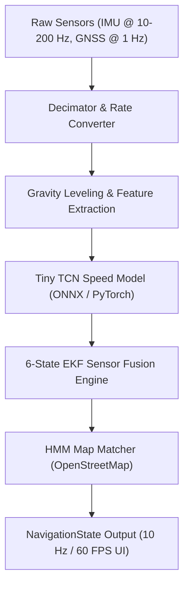
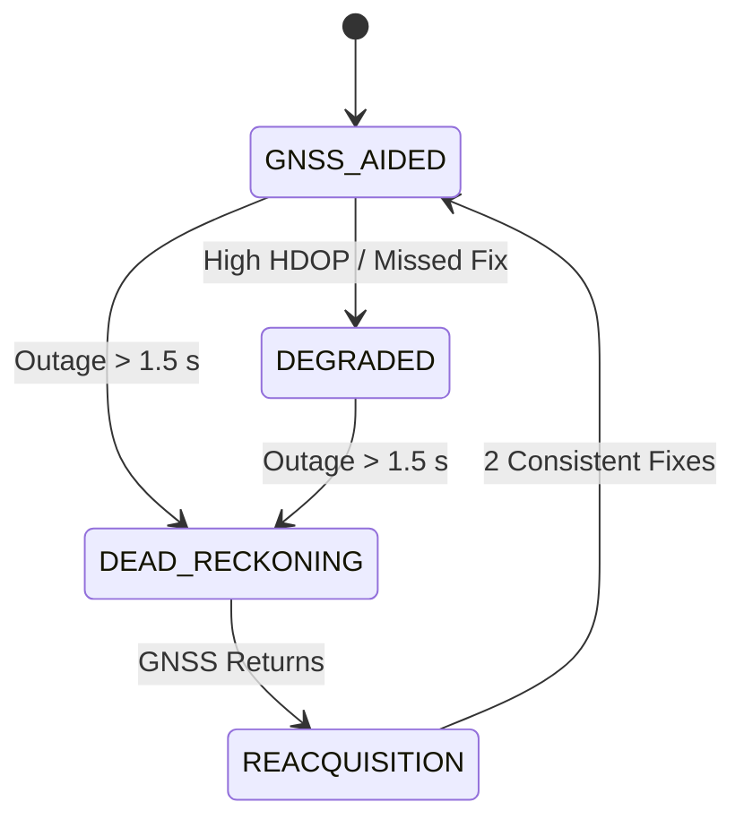

# Intelligent Dead Reckoning (IDR) — Navigation Pipeline Documentation

This document provides a comprehensive, end-to-end technical breakdown of the **Intelligent Dead Reckoning (IDR)** pipeline developed for **SIH Problem Statement PS26168**.

---

## 📑 Table of Contents
1. [Pipeline Architecture Overview](#1-pipeline-architecture-overview)
2. [Step 1: Input Data & Sensor Preprocessing](#step-1-input-data--sensor-preprocessing)
3. [Step 2: AI Speed Estimation Model (Tiny TCN)](#step-2-ai-speed-estimation-model-tiny-tcn)
4. [Step 3: Extended Kalman Filter (EKF) Fusion Engine](#step-3-extended-kalman-filter-ekf-fusion-engine)
5. [Step 4: Map Matching & Kinematic Constraints](#step-4-map-matching--kinematic-constraints)
6. [Step 5: Navigation State Machine & Transitions](#step-5-navigation-state-machine--transitions)
7. [Step 6: Mobile Web (PWA) & WebAssembly Runtime](#step-6-mobile-web-pwa--webassembly-runtime)
8. [Performance & Accuracy Benchmarks](#performance--accuracy-benchmarks)

---

## 1. Pipeline Architecture Overview

The IDR system converts high-rate smartphone IMU sensor readings and intermittent GNSS (GPS) signals into continuous, high-precision vehicle position, speed, and heading estimates—even during prolonged GNSS signal outages (e.g., in tunnels or urban canyons).



### Core Contracts
- **Input (`SensorFrame`)**:
  - Timestamp (seconds)
  - Accelerometer: $a_x, a_y, a_z$ ($\text{m/s}^2$, including gravity)
  - Gyroscope: $g_x, g_y, g_z$ ($\text{rad/s}$)
  - GNSS (optional): `{latitude, longitude, speed (m/s), heading (compass°), accuracy (m)}`
- **Output (`NavigationState`)**:
  - `{timestamp_ms, latitude, longitude, east, north, speed_kmh, heading_compass_deg, mode, gnssQuality, aiSpeed, aiConfidence, mapConfidence, positionStdM}`

---

## Step 1: Input Data & Sensor Preprocessing

**Source Code**: [`src/preprocessing/features.py`](file:///d:/AIMLProjects/sih/prototypefinal/src/preprocessing/features.py), [`src/preprocessing/parse_trip.py`](file:///d:/AIMLProjects/sih/prototypefinal/src/preprocessing/parse_trip.py)

### 1. Rate Decimation
* Smartphone IMU sensors sample at 10 Hz up to 200 Hz.
* The `Decimator` block averages high-rate readings into uniform **10 Hz windows** (0.1 s steps).

### 2. Stand Calibration & Gravity Tracking
* **Gravity Tracker**: Uses a low-pass complementary filter to isolate the 3D gravity vector $\mathbf{g}_{rest} = [g_x, g_y, g_z]^T$ from vehicle accelerations.
* **Leveling Matrix**: Projects 3D phone accelerations into gravity-aligned horizontal ($a_{h1}, a_{h2}$) and vertical ($a_v - g$) acceleration components. This renders the features **invariant to phone tilt or orientation**.

### 3. Feature Matrix Construction (9 Channels)
For every 10 Hz frame, a 9-dimensional motion vector is computed:
1. $a_{h1}$: Horizontal acceleration axis 1
2. $a_{h2}$: Horizontal acceleration axis 2
3. $a_v - g$: Vertical acceleration minus gravity
4. $\omega_{h1}$: Horizontal pitch/roll gyro rate 1
5. $\omega_{h2}$: Horizontal pitch/roll gyro rate 2
6. $\omega_{yaw}$: Vehicle yaw rate (gyro axis parallel to gravity)
7. $|a| - g$: Total acceleration magnitude minus gravity
8. $|a_h|$: Total horizontal acceleration magnitude
9. $|\omega|$: Total 3D angular rate magnitude

---

## Step 2: AI Speed Estimation Model (Tiny TCN)

**Source Code**: [`src/models/tiny_tcn.py`](file:///d:/AIMLProjects/sih/prototypefinal/src/models/tiny_tcn.py), [`models/idr_tcn.onnx`](file:///d:/AIMLProjects/sih/prototypefinal/models/idr_tcn.onnx)

```text
Input Window: (1 x 9 x 40) IMU Features  +  [v_ref, t_since_ref, ref_valid]
                     │
         ┌───────────┴───────────┐
         │  Causal Dilated TCN   │ (3 Residual Blocks, 25.8k params)
         └───────────┬───────────┘
                     │
          Outputs: (v_f, log_var, stat_logit)
```

### Architecture Details
- **Type**: Causal 1D Temporal Convolutional Network (TCN) with receptive field = 40 frames (4.0 seconds).
- **Parameters**: 25,835 parameters (~131 KB ONNX model size).
- **Inference Time**: 0.19 ms per window.
- **Reference Speed Conditioning**: Accepts the last trusted GNSS speed reference ($v_{ref}$), time elapsed ($t_{since\_ref}$), and validity flag ($ref\_valid$).

### Model Outputs (`AIOutput`)
1. **Speed ($v_f$)**: Forward vehicle speed ($\text{m/s}, \ge 0$).
2. **Log Variance ($\ln \sigma_v^2$)**: Calibrated uncertainty used dynamically by the EKF measurement matrix.
3. **Stationary Logit ($P_{stat}$)**: Probability that the vehicle is stationary ($v = 0$), triggering Zero-Velocity Updates (ZUPT).

---

## Step 3: Extended Kalman Filter (EKF) Fusion Engine

**Source Code**: [`src/navigation/ins_ekf.py`](file:///d:/AIMLProjects/sih/prototypefinal/src/navigation/ins_ekf.py)

The EKF tracks a 6-dimensional state vector $\mathbf{x}$:

$$\mathbf{x} = \begin{bmatrix} E \\ N \\ \psi \\ v \\ b_g \\ s_g \end{bmatrix} \begin{matrix} \text{East position (m)} \\ \text{North position (m)} \\ \text{Yaw heading (radians CCW from East)} \\ \text{Forward speed (m/s)} \\ \text{Gyroscope bias (rad/s)} \\ \text{Gyroscope scale factor} \end{matrix}$$

### 1. Prediction Step (10 Hz Prediction)
State transition equations:
$$\dot{E} = v \cdot \cos(\psi)$$
$$\dot{N} = v \cdot \sin(\psi)$$
$$\dot{\psi} = (1 + s_g) \cdot \omega_{yaw} - b_g$$

### 2. Update Steps (Measurement Processing)
* **GNSS Measurement Update**: When valid GNSS fixes arrive ($1\text{ Hz}$), updates position ($E, N$), speed ($v$), and heading ($\psi$).
* **AI Speed Measurement Update**: Fuses AI predicted speed $v_f$ with dynamic measurement variance $R_v = \max(4 \cdot \sigma_v^2, 0.25)$.
* **Zero-Velocity Update (ZUPT)**: When $P_{stat} > 0.5$, sets target speed to $0\text{ m/s}$ and locks position drift.

---

## Step 4: Map Matching & Kinematic Constraints

**Source Code**: [`src/navigation/map_matching.py`](file:///d:/AIMLProjects/sih/prototypefinal/src/navigation/map_matching.py), [`src/preprocessing/fetch_osm.py`](file:///d:/AIMLProjects/sih/prototypefinal/src/preprocessing/fetch_osm.py)

### 1. Offline OpenStreetMap (OSM) Road Network
* Downloads surrounding road geometry into GeoJSON offline files (`data/maps/<trip>.geojson` or `nav/maps/live.geojson`).
* Builds a spatial R-tree graph of road segments and waypoints.

### 2. Online Hidden Markov Model (HMM)
* Evaluates candidate road segments based on:
  - **Emission Probability**: Distance from raw EKF estimate to road segment.
  - **Transition Probability**: Routing compatibility along the road network topology.

### 3. Kinematic Constraints
* **Non-Holonomic Constraint (NHC)**: Enforces zero lateral/vertical velocity (cars move along their longitudinal axis, not sideways).
* **Map Pseudo-Measurements**: Feeds cross-track error and road orientation angle back into the EKF measurement updates during GNSS blackouts.

---

## Step 5: Navigation State Machine & Transitions

**Source Code**: [`src/navigation/gnss_quality.py`](file:///d:/AIMLProjects/sih/prototypefinal/src/navigation/gnss_quality.py), [`src/navigation/pipeline.py`](file:///d:/AIMLProjects/sih/prototypefinal/src/navigation/pipeline.py)



### State Definitions
1. **`GNSS_AIDED`**: Strong GNSS coverage. Position, speed, and heading are continuously calibrated.
2. **`DEGRADED`**: GNSS accuracy deteriorates or fix intervals become sparse.
3. **`DEAD_RECKONING`**: Complete GNSS blackout (Tunnel mode). Position is propagated exclusively using AI Speed + Gyroscope + Map Matching. Declared 1.5× fix interval after last fix (~1.5s).
4. **`REACQUISITION`**: GNSS signal recovers. Requires 2 consistent fixes before fully re-anchoring to prevent jump artifacts.

---

## Step 6: Mobile Web (PWA) & WebAssembly Runtime

**Source Code**: [`src/web/server.py`](file:///d:/AIMLProjects/sih/prototypefinal/src/web/server.py), [`src/web/nav/`](file:///d:/AIMLProjects/sih/prototypefinal/src/web/nav/)

### Features
* **Zero Installation**: Standard HTML5/Vanilla JS PWA running in Chrome or Safari.
* **ONNX Runtime WebAssembly (`onnxruntime-web`)**: Executes `idr_tcn.onnx` locally on the phone's CPU with zero latency and full privacy.
* **HTTPS Server**: Serves files over TLS (`https://<LAN-IP>:8443`) to satisfy mobile browser security policies for `DeviceMotionEvent` and `Geolocation` APIs.
* **UI Features**: 60 FPS smooth canvas vehicle marker, live meters, stand calibrator, and simulated tunnel toggle.

---

## 📊 Performance & Accuracy Benchmarks

All metrics measured on the held-out benchmark dataset (IO-VNBD test trip `S1`):

| Metric | Target / Baseline | Measured Result |
|---|:---:|:---:|
| **AI Speed Model MAE** | < 2.0 m/s (Old: 5.17 m/s) | **1.59 m/s** |
| **Stop Detection F1 Score** | > 0.80 | **0.85** |
| **60s Tunnel Outage Drift** | Target < 10% (Old: 97%) | **9.2%** *(Median)* |
| **120s Tunnel Outage Drift** | Target < 10% (Old: 81%) | **9.1%** *(Median)* |
| **10 Hz Phone Processing Speed** | 100 ms budget | **0.89 ms / frame** *(113× real-time)* |
| **200 Hz Edge Processing Speed** | 5 ms budget | **0.12 ms / frame** *(43× real-time)* |
