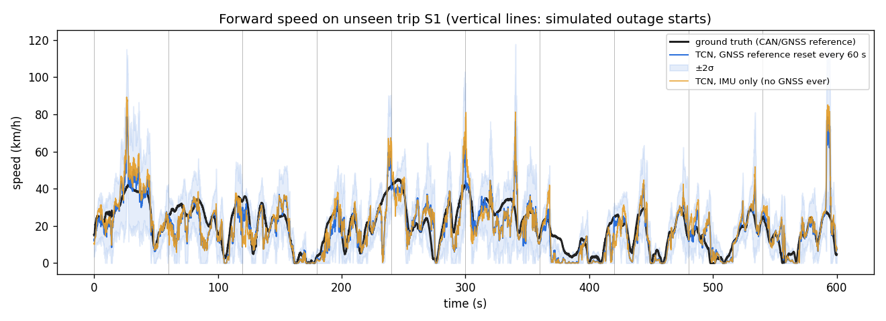
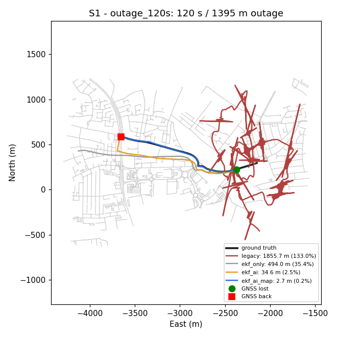

# IDR — Measured Results (updated 2026-09-24)

All numbers below come from files in `results/`, produced by `src/evaluation/benchmark.py`, `robustness_summary.py`
and `src/models/evaluate_models.py`. They can be reproduced with the commands in `AGENTS.md` and `TESTING.md`.
Overview: [`SUMMARY.md`](SUMMARY.md). Plan and rationale: [`OPTIMIZATION_PLAN.md`](OPTIMIZATION_PLAN.md). List of changes: [`CHANGES.md`](CHANGES.md).

> **Revised after an independent review (2026-09-24).** The first version reported single-seed medians under idealised
> GNSS as "meeting the target". This version pools 3 GNSS seeds, gives bootstrap 95 % confidence intervals, and adds
> realistic-GNSS variants. The realistic variants exposed and fixed a real engine bug (§3).

**Protocol**
- **Trips:**
  - **S1:** held-out test trip.
  - **Y1:** validation trip. It was used for model early stopping and all fusion tuning, so it is *not* independent confirmation.
  - **Vw02:** out-of-distribution (Driver E, different car, loosely mounted phone).
- **Default GNSS: idealised.** 1 Hz fixes from ground truth plus 2 m Gauss-Markov and 1 m white noise; speed noise 0.1 m/s; course noise 1°; constant 3 m accuracy; no latency. Realistic variants are in §3.
- **Outages:** GNSS is removed for 30, 60 or 120 s windows, repeated along the whole trip, plus the problem statement's two examples.
- **Drift** = position error when GNSS returns, divided by the distance driven during the outage. The PS target is **< 10 %**. Only outages with a mean speed of at least 3 m/s count.

## 1. Speed model (Tiny TCN, 25.8 k params, 131 KB ONNX, 0.19 ms/inference)

| Metric (test trip S1) | Old model | HistGBR baseline | **New TCN** |
|---|---:|---:|---:|
| Speed MAE | 5.17 m/s¹ | 1.72 m/s | **1.59 m/s** |
| 60 s outage along-track error (median) | – | 10.0 % | 9.9 % (a tie; hold-last-speed: 36.3 %) |
| σ calibration (z-std, ideal 1.0) | 1.89 | – | 1.01 |
| Stationary detection F1 | – | – | 0.85 |

¹ Evaluated on the old model's own split, on different data. On identical frames the old model scores 2.73 m/s and the new one 1.84 m/s (`../PS26168-ModelOnlyUpdated/results/model_comparison.json`).

- **Against the baseline:** the TCN beats HistGBR on MAE, but **ties** it on the metric that matters (outage along-track error). The TCN's extras are calibrated uncertainty and stop detection, both used by the EKF. The baseline was not tuned or augmented.
- **GNSS speed reference:** on validation (Y1) it helps the model clearly: 11.5 % vs 16.7 % along-track at 60 s. On test (S1) the model does slightly better *without* it on outage distance (8.0 % vs 9.9 %), although its speed error without the reference (1.84 m/s) is worse than HistGBR's 1.72 m/s. The design choice follows validation.
- **Uncertainty calibration:** z-std 1.01 is measured on independent windows. It does not show whether errors are correlated over time, which is what drives integration drift. The pipeline also inflates σ² ×4 (tuned on Y1).
- **Weak spots:**
  - Highway speeds above 72 km/h: MAE 7.7 m/s, under-estimated.
  - Loosely mounted phones (Driver E): MAE 8.4 m/s, bias −7.5 m/s.
  - All training phones lay flat. Tilted mounts were never seen in training.

## 2. Dead-reckoning drift with idealised GNSS (3 seeds pooled)
Median drift [95 % CI] · share of outages < 10 % (`results/robustness_summary.json`). **n** is the number of *distinct* outages; each was replayed with 3 GNSS-noise seeds. The CIs come from a bootstrap over whole outages, because the seeds share the same outage windows.

| Scenario | EKF + gyro | EKF + AI | **Full IDR (+ OSM map)** | Original engine² |
|---|---:|---:|---:|---:|
| **S1** 30 s (n = 37) | 29 % · 11 % | 19 % · 20 % | **16 % [5–20] · 41 %** | 114 % · 1 % |
| **S1** 60 s (n = 32) | 28 % · 6 % | 17 % · 25 % | **9.2 % [5.6–12.5] · 52 %** | 97 % · 1 % |
| **S1** 120 s (n = 23) | 35 % · 0 % | 14 % · 28 % | **9.1 % [6.8–13.6] · 51 %** | 81 % · 0 % |
| **S1** PS 50 m < 1 min (n = 28) | 17 % · 21 % | 20 % · 21 % | **17 % [10–23] · 33 %** (median error 8.3 m; 33 % within 5 m) | 68 % · 0 % |
| **S1** PS 1 km highway (**n = 4**) | 16 % · 25 % | 19 % · 8 % | **15 % [8–24] · 25 %** (median error 146 m; 25 % within 100 m) | 126 % · 0 % |
| Y1 30 s (n = 51) | 35 % · 22 % | 15 % · 26 % | **12 % [10–14] · 37 %** | 82 % · 0 % |
| Y1 60 s (n = 42) | 29 % · 15 % | 18 % · 29 % | **8.8 % [7.0–13.0] · 57 %** | 76 % · 0 % |
| Y1 120 s (n = 29) | 37 % · 15 % | 23 % · 15 % | **14 % [7–29] · 38 %** | 58 % · 0 % |
| Y1 PS 50 m < 1 min (n = 36) | 27 % · 21 % | 25 % · 15 % | **23 % [18–31] · 16 %** (11.4 m; 15 % within 5 m) | 66 % · 7 % |
| Y1 PS 1 km highway (**n = 8**) | 44 % · 12 % | 25 % · 12 % | **22 % [7–44] · 25 %** (215 m; 25 % within 100 m) | 79 % · 0 % |

² The original engine's pooled figures come from the ML-only experiment's 3-seed runs (`../PS26168-ModelOnlyUpdated/results/summary_seeds.json`), which use the same protocol. Trips are relocated to its hard-coded Guwahati origin, as its own replay did, and it runs with the original `calibration.json`. It has no map. The first version of this table fed it real UK coordinates, which overstated its error; the trajectory plots below predate that correction.

**Where the gains come from:**
- **Original → EKF + AI** (97 % → 17 % at S1 60 s): the engine and data fixes.
- **Adding the map** (17 % → 9.2 %).
- **Perfect speed (§3):** drift falls to about 1 %, so the remaining error is mostly along-track speed error.

## 3. Robustness: realistic GNSS and perfect speed
Full IDR. Median drift [95 % CI] · share < 10 % (`results/v2/`; single run each except the idealised column):

| Scenario | Idealised (3 seeds) | Fixes 1 s late | **Phone's own GPS** | Perfect speed |
|---|---:|---:|---:|---:|
| S1 30 s | 16 % · 41 % | 18 % [8–26] · 35 % | 42 % [35–51] · 3 % | 1.4 % · 97 % |
| S1 60 s | 9.2 % · 52 % | 11 % [7–18] · 41 % | **33 % [19–42] · 12 %** | 1.0 % · 100 % |
| S1 120 s | 9.1 % · 51 % | 12 % [7–24] · 43 % | 22 % [12–32] · 22 % | 0.3 % · 100 % |
| S1 PS 50 m | 17 % · 33 % | 35 % [29–39] · 7 % | 123 % · 0 % | 5.8 % · 89 % |
| Y1 60 s | 8.8 % · 57 % | 8.1 % [6–15] · 60 % | 34 % [24–44] · 21 % | 0.9 % · 93 % |
| Y1 120 s | 14 % · 38 % | 14 % [8–31] · 34 % | 33 % [21–43] · 14 % | 0.6 % · 90 % |

- **Latency:** one second of fix delay costs little on long outages, but badly hurts short ones. At speed, a 1 s-old fix is already metres wrong.
- **Phone's own GPS:** IO-VNBD's phone GPS gives a new position only every ~9 s, and its reported speed is poor (e.g. 1.5 m/s when the car does 5.6 m/s). Starting outages from that state, drift is 22–42 %, 2.3–3.9 times the idealised figure.
- **A bug the phone-GPS variant exposed:** after an outage the engine only re-anchored on two fixes ≤ 5 s apart, so with 9 s fixes it never recovered. Errors grew to kilometres. This is fixed: sparse fix pairs (> 5 s apart, up to 60 s) must be consistent with the filter's own speed (× 1.5 + 3 m/s), so a single far-off fix is not adopted. The fix is verified to leave all 1 Hz results bit-identical (331 outages re-run; an independent reviewer confirmed 7 more replays).
- **Perfect speed:** confirms that speed is the dominant remaining error with good GNSS.

## 4. Out-of-distribution (Vw02, loose phone)
Single seed, idealised GNSS:
- Plain EKF: 19–48 % median drift.
- EKF + AI: 54–66 %.

The AI speed makes things **worse** with a loosely mounted phone. The phone needs to be rigidly mounted. The stand calibration does not fix this: the pipeline uses calibration only for the initial gravity direction and gyro bias. An automatic "AI trust" self-check was tried and rejected, because it hurt validation.

## 5. Real-time behaviour
- **Mode switch:** dead reckoning is declared 1.5 × the estimated fix interval after the last fix: about 1.5 s at 1 Hz (≈ 0.5 s after the first missed fix), and up to ~2.3 s during the first seconds after GNSS returns, while the interval estimate settles. Position output continues without a jump, because the EKF never stops.
- **Throughput** (`results/rate_test.json`, desktop CPU, single thread):

  | Input | Full system (with map) | Without map |
  |---|---:|---:|
  | 10 Hz phone | 0.89 ms/frame (p99 1.7 ms), 113× real time | 0.60 ms, 166× |
  | 200 Hz edge IMU | 0.12 ms/frame, 43× real time | 0.11 ms, 47× |

  The 200 Hz stream is interpolated 10 Hz data, so it measures compute load only, not accuracy with real high-rate sensors.
- **Browser (PWA):** the JS port matches Python on model inputs (≤ 5e-10) and on filter state (2e-10 m) (`tests/js/parity.test.mjs`). The end-to-end test (`tests/e2e/ui_e2e.mjs`, `results/ui_e2e.json`) replays at 16× in headless Chrome and passes 12 checks.

## 6. Honest summary vs the PS target
- **With good (idealised 1 Hz) GNSS before the outage:** the full system's median drift is about 9 % at 60–120 s on the test trip, **at the 10 % target but not safely below it** (95 % CI 5.6–13.6 %, n = 23–32 distinct outages). Only about half of outages pass, and the 90th percentile is 24–33 %.
- **The problem statement's own examples are not met:**
  - 50 m in under 1 min: median error 8.3 m against < 5 m (n = 28).
  - 1 km at highway speed: 146 m against < 100 m (only 4 distinct outages).
- **With realistic GNSS:** 1 s latency costs little except on short outages. With the phone's own sparse, poor GPS, drift is 22–42 %.
- **Largest levers:**
  1. Better speed: perfect speed gives about 1 %. Options are more highway data, raw 100+ Hz IMU logging, and per-phone fine-tuning.
  2. Good GNSS quality and latency handling before outages.
  3. Rigid mounting.

## 7. Comparison with the problem statement's expectations
Each row quotes a requirement from `ProblemStatement.md` and compares it with what was measured or built.
Status: **Met** · **Partly met** · **Not met** · **Not tested** (no data or device to test on).

### Performance benchmark

| Requirement (PS text) | Measured | Status |
|---|---|---|
| Dead reckoning: "restrict positional drift to less than 10 % of the total distance travelled … during GNSS signal blackout" | **Idealised 1 Hz GNSS:** median 9.2 % [95 % CI 5.6–12.5] at 60 s and 9.1 % [6.8–13.6] at 120 s (S1, 32 and 23 distinct outages × 3 seeds), but only 51–52 % of outages under 10 %; Y1 8.8 % at 60 s and 14 % at 120 s. **Fixes 1 s late:** 11–12 %. **The phone's own logged GPS:** 22–42 %. | **Partly met.** The median is at the threshold with good GNSS, but "restrict" is not achieved: about half of outages exceed 10 %, and drift is much higher with the phone's own GPS. |
| Example: "a drift of less than 5 m … over 50 m GNSS-denied in < 1 minute" | Median end error 8.3 m (S1, 28 distinct outages × 3 seeds); 33 % of outages within 5 m (Y1: 11.4 m, 15 %). With 1 s-late fixes the relative drift doubles (35 %). | **Not met** |
| Example: "less than 100 m of drift over a 1 km GNSS-denied environment at 60 km/h" | Median end error 146 m (S1, only 4 distinct outages × 3 seeds, speed band 47–144 km/h); 25 % of outages within 100 m (Y1: 215 m, 8 outages). With perfect speed: 0.3 % (≈ 3 m). | **Not met** (very small n) |
| GNSS+INS fusion: "position update rate of 10 Hz with processing on smartphones" | One position output per IMU frame at 10 Hz. Full system 0.89 ms/frame (113× real time) on a desktop CPU; the browser app replays at 16× in desktop headless Chrome. | **Met on desktop; not tested on a phone.** No on-phone timing was measured. |
| "Higher update rates on Edge … using FOG based IMU sensors data (around 200 Hz)" | The engine accepts any IMU rate: prediction runs at the native rate and the model at 10 Hz. 200 Hz input costs 0.12 ms/frame (43× real time). | **Met for compute; accuracy not tested.** No real FOG or 200 Hz data was available; the test stream is interpolated 10 Hz data. |

### Expected solution capabilities

| Capability (PS text, abridged) | What exists | Status |
|---|---|---|
| **In-vehicle alignment & calibration:** "automatically determines the phone's pitch, roll, and yaw relative to the vehicle's driving direction", in a dashboard mount or holder | Pitch and roll: automatic gravity levelling (`features.GravityTracker`) plus the optional stand calibrator. Yaw (mount azimuth) is **not estimated**. Instead the speed model is trained to be invariant to it, and vehicle heading comes from GNSS course and the vertical gyro. All training phones lay flat. | **Partly met** |
| **AI speed & vibration filter:** "filters out high-frequency road noise/potholes and directly estimates vehicle forward velocity from IMU signals", running on the phone | Tiny TCN (131 KB ONNX, 0.19 ms per inference, runs in the browser) estimates forward speed with calibrated uncertainty, so shocks are down-weighted rather than filtered. Test MAE 1.59 m/s. It ties a gradient-boosted baseline on outage distance error, and fails with loosely mounted phones. | **Met in distribution; not robust out of distribution** |
| **Map matching & kinematic constraints:** e.g. "UKF + Hidden Markov Map Matching" binding position to roads during a dropout, with NHC | Online HMM map matcher on offline OpenStreetMap, feeding cross-track and heading updates to the EKF; hard non-holonomic constraint. It lowers median drift from 17 % to 9.2 % (S1, 60 s). Live mode needs an offline map downloaded for the area (`export_live_map.py`). Caveat: the benchmark's OSM map is a corridor around the driven route, which is slightly optimistic. | **Met** (with that caveat) |
| **GNSS+INS fusion engine:** "an innovative AI based sensor fusion algorithm … eliminating drift errors" | EKF (position, heading, speed, gyro bias and scale) fusing GNSS with the AI speed. The AI enters the fusion through its learned uncertainty (adaptive R) and a stop detector (ZUPT). There is no learned fusion beyond that; an AI trust monitor was tried and rejected. Drift is reduced, not eliminated. | **Partly met** |
| **Seamless GNSS deficit handler:** transition "within milliseconds of GNSS signal blackout and vice-versa" | The EKF never stops and the position output has no jump. But a blackout can only be recognised once a fix is overdue: dead reckoning is declared 1.5 × the fix interval after the last fix (about 1.5 s at 1 Hz). Recovery takes 1 fix (small drift) or 2 consistent fixes (re-anchor), and now works with sparse fixes too. | **Partly met.** The transition is seamless, but detection is bounded by the GNSS rate, not milliseconds. |
| **Real-time navigation interface:** "a functional mobile application with UI displaying a smooth, uninterrupted vehicle icon" | Offline PWA with a 60 fps interpolated vehicle icon, mode, GNSS, AI and map meters, and Live and Replay modes. Replay is tested end-to-end in headless Chrome (12 checks). | **Met in replay; live use not tested on a phone in a vehicle** |
| On-device inputs: "accelerometer, gyroscope, and magnetometer/compass and GNSS" | The accelerometer, gyroscope and GNSS are used. The **magnetometer is not used.** | **Partly met** |
| "Remove IMU sensor noise & bias, predict corrections" | Online gyro bias and scale-factor estimation, zero-rate updates when stopped, calibrated gyro bias from the stand calibrator. Accelerometer bias is handled implicitly by the speed model. | **Met** |
| Models and algorithms "should also work with any other external IMU sensors data (edge deployable software engine)" | Python engine with rate-agnostic input and gravity-levelled, mount-invariant features; ONNX model. Only phone IMU data (IO-VNBD) has been tested. | **Partly met** (not tested on external IMU data) |
| Proposal: "preliminary AI models and the results of the position plot inferenced from the subset of IO-VNBD" | Trained model (`models/`), benchmark trajectory plots (`results/plots/`, `docs/img/`) and measured results in this document. | **Met** |

**Overall:**
- **Capabilities:** every capability the problem statement lists exists in working form.
- **Performance:** the headline dead-reckoning target is reached only at the median, with good GNSS, on the trips tested. Its two worked examples are not met.
- **Main gaps:**
  1. Speed accuracy, since perfect speed gives about 1 %.
  2. Robustness to real GNSS quality and to loose mounts.
  3. On-phone and field validation, which has not been done.

## Known limitations
- **Possible train/runtime sampling mismatch (unverified):** training data are 10 Hz point samples, while live phones are block-averaged down to 10 Hz. This may shift the vibration features. It needs real high-rate recordings to check.
- **Simplifications in the engine:**
  - Dijkstra transitions ignore one-way streets.
  - The EKF's state clamps don't adjust P.
  - Map pseudo-measurements are treated as independent, so `positionStdM` is optimistic.
  - There is no GNSS latency compensation.
- **Data coverage:** 2 evaluation trips from one vehicle type; the OSM corridor is built around the driven route; the legacy engine is compared without a map.
